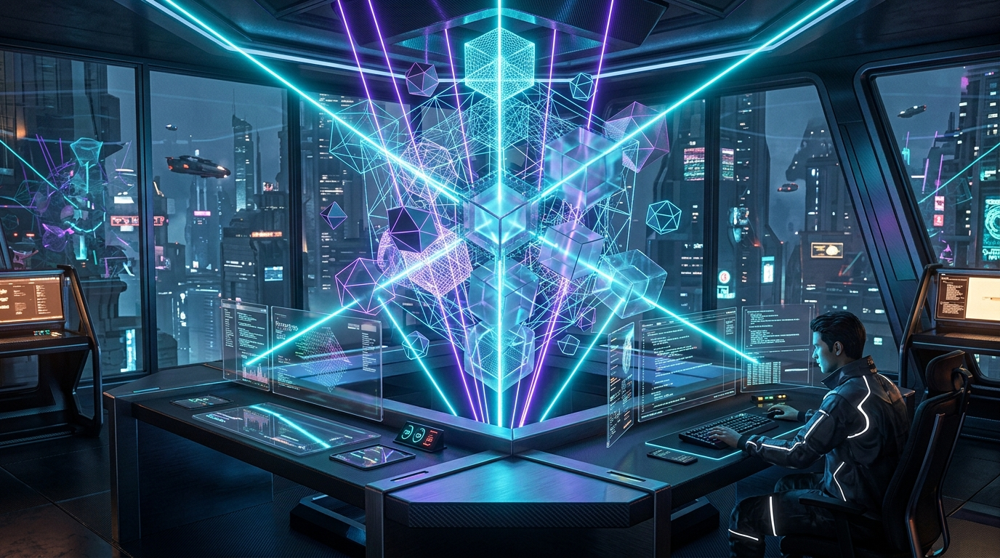

<!-- ================================================================= -->
<!--                         HERO / BANNER                             -->
<!-- ================================================================= -->

<div align="center">
  
</div>

<div align="center">
  
</div>

<br/>

<div align="center">
  <a href="https://git.io/typing-svg">
    
  </a>
</div>

<div align="center">

  <a href="https://www.linkedin.com/in/smit-pathak" target="_blank">
    
  </a>
  <a href="mailto:pathaksmit23@gmail.com">
    
  </a>
  <a href="https://github.com/smit45-m" target="_blank">
    
  </a>
  

</div>

<br/>


<!-- ================================================================= -->
<!--               3D HOLO-CONSOLE & SYSTEM TELEMETRY                  -->
<!-- ================================================================= -->

<details open>
<summary><b>🧊 <code>spatial_telemetry.sh</code> — 3D Core & System Telemetry</b> <i>(Click to toggle)</i></summary>

```jsonc
{
  "system": "Smit-Neural-3D-Kernel",
  "architect": "Smit Pathak",
  "institution": "National Institute of Technology, Rourkela",
  "degree": "B.Tech in Artificial Intelligence (2024 - 2028)",
  "specializations": {
    "3d_spatial_computing": ["Blender Procedural (bpy)", "Three.js", "WebGL", "Cycles/EEVEE PBR", "Kinematic Assemblies"],
    "cloud_infrastructure": ["Amazon Web Services (AWS)", "AWS EC2", "AWS S3", "AWS Lambda", "AWS SageMaker", "ECS/EKS"],
    "intelligent_systems": ["Autonomous Multi-Agent Swarms", "LangGraph", "Deep NLP", "PyTorch Neural Inference"]
  },
  "render_pipeline": {
    "viewport": "Cycles OptiX Raytracing & Real-time WebGL Shaders",
    "deployment": "Containerized Microservices on Kubernetes & AWS Cloud"
  },
  "current_focus": "Merging generative multi-agent systems with real-time procedural 3D graphics & cloud-scale MLOps",
  "telemetry_status": "🟢 ONLINE | Accepting high-impact AI/ML, 3D & Cloud engineering collaborations"
}
```

</details>

<br/>

<!-- ================================================================= -->
<!--                    ARCHITECTURAL CAPABILITIES                     -->
<!-- ================================================================= -->

## ⬢ Engineering Capabilities & Focus

I engineer at the intersection of **3D Spatial Computing & Computer Graphics**, **Scalable Cloud MLOps on AWS**, and **Autonomous Multi-Agent Artificial Intelligence**.

* 🧊 **Procedural 3D Graphics & Spatial Computing:** Developing programmatic 3D generative pipelines in **Blender** using the Python **`bpy`** API. Engineering intricate parametric assemblies (such as Formula 1 internal kinetic powertrains), architectural spatial models (NIT Rourkela 3D digital twins), photorealistic Cycles lighting setups, and real-time interactive **Three.js / WebGL** viewports with custom shader materials.
* ☁️ **Cloud Infrastructure & AWS MLOps:** Architecting resilient, high-throughput cloud environments on **Amazon Web Services (AWS)**. Leveraging **AWS SageMaker** for scalable model training and distributed endpoints, **AWS Lambda** for event-driven serverless compute, **Amazon EC2 & S3** for heavy neural workloads and asset pipelines, containerized with **Docker** and orchestrated over **Kubernetes** clusters with automated **CI/CD**.
* 🤖 **Autonomous Multi-Agent AI & Neural Systems:** Designing resilient agentic graphs using **LangGraph**, **CrewAI**, and **LangChain**. Formulating multi-agent state machines with memory persistence, self-correcting evaluation loops, and low-latency vector embeddings across **Pinecone** and **ChromaDB**.
* ⚡ **High-Throughput Microservice Backends:** Constructing asynchronous **FastAPI** architectures with rigorous **Pydantic** schema validation, low-latency relational engines (**MySQL**), and high-performance algorithms in **Python** and **C++**.

<br/>


<!-- ================================================================= -->
<!--                    INTERACTIVE TECH ARSENAL                       -->
<!-- ================================================================= -->

## 🛠️ Interactive Tech Arsenal

<div align="center">
  
</div>

<br/>

<details open>
<summary><b>🧊 3D Modeling, Procedural Engineering & Spatial Graphics</b></summary>
<br/>

<p align="left">
  
  
  
  
  
</p>

* **Procedural CAD & Animation:** Programmatic mesh generation via **Blender `bpy`**, complex hierarchical assemblies, keyframe interpolation, geometry nodes, and procedural texture baking.
* **Real-Time 3D WebGL:** Interactive in-browser 3D viewports powered by **Three.js**, PBR material shading, dynamic lighting, OrbitControls, and exploded component disassembly.
* **Rendering Engines:** High-fidelity raytraced rendering using **Cycles (OptiX / CUDA)** and real-time rasterization with **EEVEE Next**.

</details>

<details open>
<summary><b>☁️ Cloud Infrastructure, MLOps & Containerization (AWS Powered)</b></summary>
<br/>

<p align="left">
  
  
  
  
  
  
  
  
  
  
</p>

* **Cloud Architecture:** Elastic compute instances with **AWS EC2**, scalable object and model weight repositories with **Amazon S3**, serverless event-driven processing via **AWS Lambda**, and end-to-end MLOps management via **AWS SageMaker**.
* **Orchestration:** Multi-stage production builds with **Docker**, resilient multi-replica auto-scaling on **Kubernetes**, automated testing and continuous integration via **GitHub Actions**.

</details>

<details open>
<summary><b>🤖 Generative AI & Autonomous Agentic Workflows</b></summary>
<br/>

<p align="left">
  
  
  
  
  
  
</p>

* **Agentic Frameworks:** Cyclic state machine coordination with **LangGraph**, role-specialized swarms using **CrewAI**, persistent memory architectures, and semantic retrieval indexing with **LlamaIndex**.

</details>

<details open>
<summary><b>🧠 Deep Learning, Computer Vision & NLP</b></summary>
<br/>

<p align="left">
  
  
  
  
  
  
  
</p>

</details>

<details open>
<summary><b>⚡ Backend, High-Performance APIs & Vector Engines</b></summary>
<br/>

<p align="left">
  
  
  
  
  
  
  
  
  
</p>

</details>

<br/>


<!-- ================================================================= -->
<!--                  CERTIFICATIONS & EDUCATION                       -->
<!-- ================================================================= -->

## 📜 Academic Matrix & Certifications

<details>
<summary><b>🎓 Academic Credentials & Specializations (Click to expand)</b></summary>
<br/>

* **National Institute of Technology, Rourkela**
  * *B.Tech in Artificial Intelligence* (2024 – 2028)
  * *Core Disciplines:* Data Structures & Algorithms, OOP in C++, Artificial Intelligence & ML, Database Management Systems (SQL), Linear Algebra.
* **Deep Learning Specialization** — *DeepLearning.AI & Coursera (2025)*
  * Neural Networks, Hyperparameter Optimization, Structuring ML Projects, CNNs, Sequence Models & Attention Mechanisms.
* **Machine Learning Specialization** — *Stanford University & DeepLearning.AI (2025)*
  * Supervised Learning, Advanced Learning Algorithms, Unsupervised Learning & Recommender Systems.
* **Leadership & Open Source:**
  * *Technical Member, OpenCode Club (NIT Rourkela):* Coordinated campus technical hackathons, conducted workshops on Git/GitHub workflows, procedural design, and deep learning.
  * *Sponsorship Committee, NITRUTSAV 2026:* Led outreach and corporate sponsorship acquisition.

</details>

<br/>


<!-- ================================================================= -->
<!--                    GITHUB TELEMETRY & STATS                       -->
<!-- ================================================================= -->

## 📈 Live Activity & GitHub Telemetry

<div align="center">

  

</div>

<br/>

<div align="center">
  <h3>🐍 Contribution Flow</h3>
  
</div>

<br/>


<!-- ================================================================= -->
<!--                         GET IN TOUCH                              -->
<!-- ================================================================= -->

## 🌐 Connect & Collaborate

<div align="center">

  <a href="https://www.linkedin.com/in/smit-pathak" target="_blank">
    
  </a>
  &nbsp;
  <a href="mailto:pathaksmit23@gmail.com">
    
  </a>
  &nbsp;
  <a href="https://github.com/smit45-m" target="_blank">
    
  </a>

  <br/><br/>
  
  <i>⚡ "Rendering reality through procedural dimensions, autonomous intelligence, and cloud-scale architectures."</i>

</div>

<div align="center">
  
</div>
